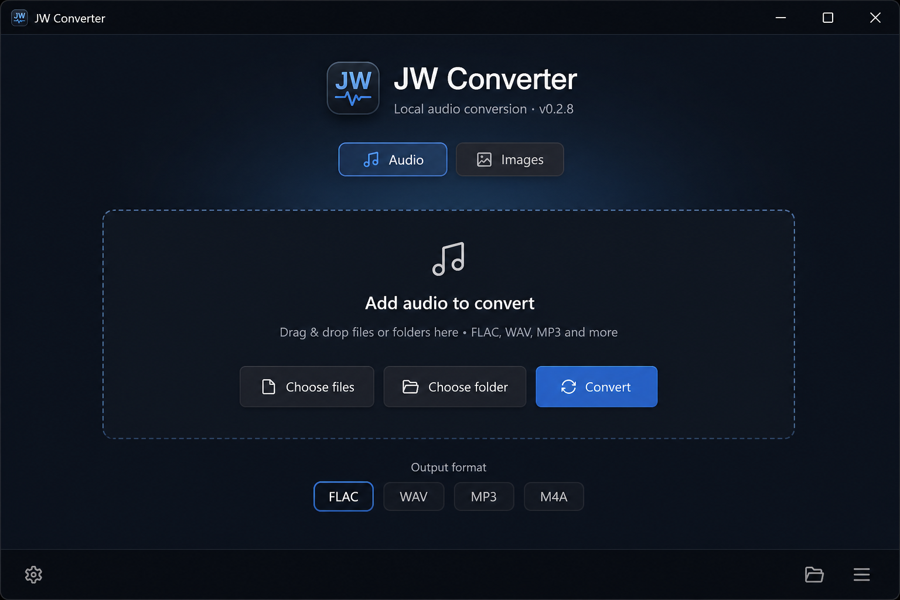

# JW Converter

Local-first Windows audio conversion utility.

Built with Tauri 2, React, TypeScript, and Rust. Conversion uses FFmpeg/FFprobe (wired in later milestones).

## Download

**[Download JW Converter for Windows (v0.2.5)](https://github.com/Salutatorian/jwconverter/releases/tag/v0.2.5)**

Grab the `.exe` installer from the latest GitHub Release, run it, and you're set. Uninstall anytime from Apps & features or `Uninstall JW Converter.exe` in the install folder. Uninstall warns you and wipes JW Converter app data (settings/cache); your converted audio files are not deleted.

From **v0.1.2** onward, the app checks for updates on launch (and every few hours). Open the gear **Settings** panel to update, or jump to GitHub / Releases / Issues. After an update, a What's New popup lists changes and fixes.



## Reddit blurb (for sharing this screenshot)

```text
Made a local-first Windows audio converter — JW Converter.

Drop files or whole folders (structure is preserved). Pick an output
format (FLAC / WAV / MP3 / M4A / AAC / Opus / OGG / ALAC / AIFF), set quality
for lossy formats (Low / Medium / High), and choose what happens if the
output already exists (Rename / Skip / Replace).

Everything runs on your PC — no accounts, no cloud upload, no telemetry.
Sources are never modified (temp → verify → finalize). Ships as a normal
Windows installer with bundled FFmpeg and an uninstall option.
```

## Status

**v0.2.5** — Preserve image metadata (default on); optional strip; soak pass.
**v0.2.4** — Image outputs: BMP, GIF (still), AVIF (HEIC out still unavailable).
**v0.2.3** — WebP Lossless + PNG compression presets (Fast / Balanced / Small).
**v0.2.2** — Images honor EXIF orientation; clearer camera RAW decode errors.
**v0.2.1** — Image resize presets + image preflight (size estimate, disk gate, honesty warnings).
**v0.2.0** — Images mode (ImageMagick): JPEG/PNG/WebP/TIFF + common RAW inputs.
**v0.1.15** — Audio foundation complete for the 0.1 line (FFmpeg licensing pack).
**v0.1.11** — MP3 CBR/VBR modes; quality chips show bitrates / VBR grades.
**v0.1.10** — M4A vs raw AAC, clearer format labels, broader input extensions.
**v0.1.9** — Preflight: quality honesty warnings, size estimate, disk space hard gate.
**v0.1.8** — Preserve tags and embedded cover art (format-aware; defaults on).
**v0.1.7** — WAV/AIFF bit depth (Original default), richer probe info, Replace/CSP hardening.

Working:

- Choose / drag multiple audio files
- Choose / drop folders (recursive scan)
- Preserve relative folder structure in output
- Analyze with FFprobe (local)
- Convert to FLAC / WAV / MP3 / M4A (AAC) / AAC (ADTS) / Opus / OGG / ALAC / AIFF
- Quality presets (Low / Medium / High) for lossy formats; MP3 CBR/VBR
- Sequential batch queue
- Temp output → verify → finalize (source never modified)
- Per-file + overall progress, cancel queue
- Default destination: Downloads
- Overwrite policy: Rename (default) / Skip / Replace
- Preflight warnings + size/disk gate
- Windows NSIS installer with app icons and bundled FFmpeg/FFprobe
- Bundled `THIRD_PARTY_FFMPEG.txt` (GPL build identity + source offer)
- In-app Settings gear: updates, GitHub / Releases / Issues, FFmpeg licensing
- In-app update check + **Update** button (install only when you click)

See `docs/ffmpeg-licensing.md` before redistributing the installer.

## Development (Windows)

Prerequisites:

- Node.js LTS
- Rust (rustup) + MSVC Build Tools
- WebView2 Runtime
- `ffprobe.exe` in `src-tauri/binaries/` (gitignored) or on PATH in debug builds

If `cargo` is not found in a new terminal, restart the terminal after installing Rust, or ensure `%USERPROFILE%\.cargo\bin` is on your PATH.

```powershell
npm install
npm run tauri dev
```

### FFmpeg / FFprobe binaries

Place `ffmpeg.exe` and `ffprobe.exe` in `src-tauri/binaries/` (gitignored).

For release packaging, also create target-triple copies (see `src-tauri/binaries/README.md`).

Licensing notes: `docs/ffmpeg-licensing.md`.

### Release installer (Windows)

```powershell
# Requires binaries with target-triple names in src-tauri/binaries/
npm run tauri build
```

Installer output (typical):

`src-tauri/target/release/bundle/nsis/JW Converter_*_x64-setup.exe`

The NSIS setup includes:

- License agreement (I Agree)
- Current user / all users install mode
- Choose install folder
- Finish options: Launch JW Converter + View README
- Uninstall via Windows Apps settings, Start Menu → JW Converter → Uninstall, or `Uninstall JW Converter.exe` in the install folder

Typecheck:

```powershell
npm run typecheck
```

Rust check:

```powershell
cd src-tauri
cargo check
```

## Architecture

```
UI (React)
  → Tauri IPC commands
    → Conversion engine (jobs, plan, run, verify)
      → media (FFmpeg/FFprobe) + fs_safety (temp/finalize)
```

## Privacy

Conversions will run entirely on your machine. No accounts, no cloud upload, no telemetry by default.
