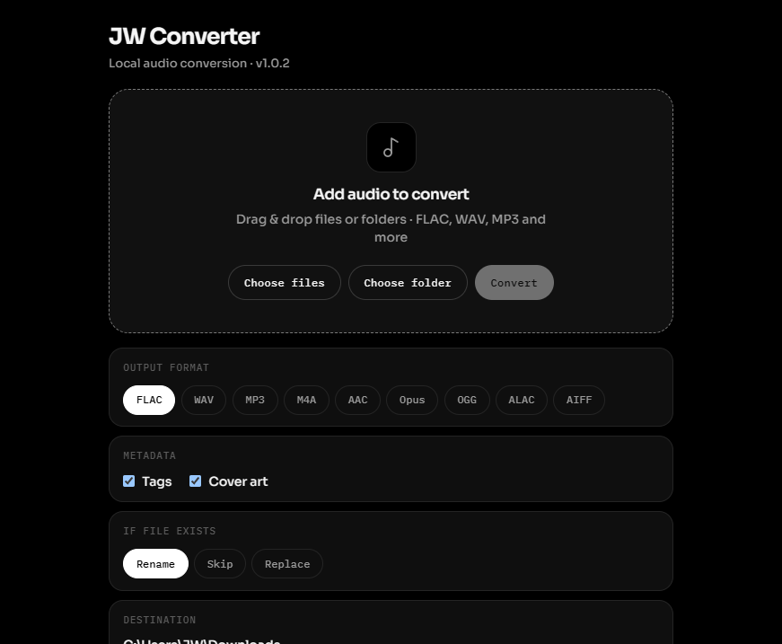
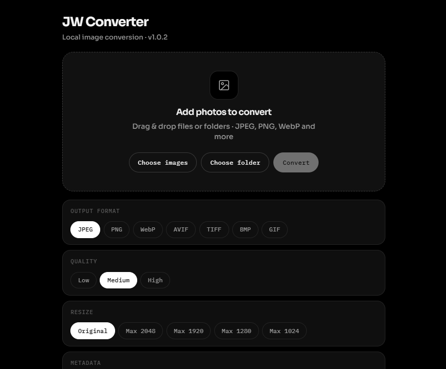
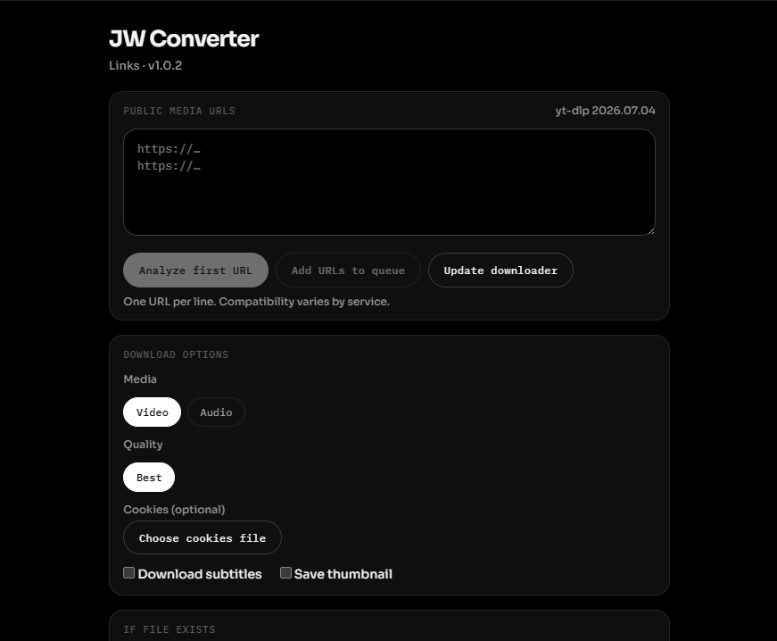

# JW Converter

Local-first converter for **audio**, **images**, and **public media links** — Windows primary, with macOS and Linux builds.

Built with Tauri 2, React, TypeScript, and Rust. Audio uses FFmpeg/FFprobe; images use ImageMagick; Links uses yt-dlp. Everything runs on your machine — **no app backend, no accounts, no cloud upload, no telemetry**.

Outbound network is only for: signed app updates (GitHub Releases), optional yt-dlp self-update (checksum-verified), user-pasted media hosts via yt-dlp, and Settings links you click.

## License

JW Converter source code is licensed under the [Apache License 2.0](LICENSE).

Bundled third-party tools (FFmpeg/FFprobe, ImageMagick, yt-dlp) remain under their own licenses — see [`third_party/`](third_party/).

## Download

**[Download JW Converter (v1.0.9)](https://github.com/Salutatorian/jwconverter/releases/tag/v1.0.9)**

- **Windows:** signed `.exe` installer (recommended day-to-day build + in-app Update)
- **macOS:** `.dmg` for Apple Silicon — **unsigned**; first launch: right-click the app → **Open** (Gatekeeper). Notarization comes later.
- **Linux:** AppImage when present on the release

Grab installers from the latest GitHub Release. On Windows, uninstall anytime from Apps & features or `Uninstall JW Converter.exe` in the install folder. Uninstall warns you and wipes JW Converter app data (settings/cache); your converted files are not deleted.

From **v0.1.2** onward, the app checks for updates on launch (and every few hours). **Windows** can install automatically; **Mac/Linux** get an in-app reminder with a download button. Open **Settings → Updates**, or jump to GitHub / Releases / Issues. After an update, a What's New popup lists changes and fixes.

## Sneak peek

Three modes in one local app — no accounts, no cloud upload.

### Audio

Convert any audio to any audio format (FLAC, WAV, MP3, M4A, AAC, Opus, and more). Drop files or whole folders, keep tags/cover art, and choose Rename / Skip / Replace when outputs already exist.



### Images

Convert photos to other image formats (JPEG, PNG, WebP, AVIF, TIFF, and more). Common **RAW** camera files can be imported and converted **to** those formats — not the other way around (you can’t export RAW).



### Links

Paste public social / media URLs and download them as **video** or **audio**, with quality, cookies, subtitles, thumbnails, and other extras. Multi-URL and playlist batches package into one `.zip` so your Downloads folder isn’t flooded.



## Reddit blurb

```text
Made a local-first Windows converter — JW Converter.

Audio, Images, and Links modes. Drop files or whole folders (structure is
preserved). Paste public media URLs for download. Pick an output format,
set quality where it matters, and choose Rename / Skip / Replace if
outputs already exist.

Everything runs on your PC — no accounts, no cloud upload, no telemetry.
Sources are never modified (temp → verify → finalize). Ships as a normal
Windows installer with bundled FFmpeg + ImageMagick + yt-dlp.
```

## Status

**v1.0.5** — Sticky Convert / Download bar on Audio, Images, and Links.  
**v1.0.4** — Links embeds video thumbnails so artwork shows when you play.  
**v1.0.3** — Security hardening (yt-dlp checksums, URL blocking, opener allowlist, no Google Fonts).  
**v1.0.2** — Links tab no longer flashes a console / freezes on open.  
**v1.0.1** — Multi Links downloads package into one .zip.  
**v1.0.0** — Links mode (yt-dlp) + Audio + Images.  
**v0.5.2** — Auto-update on launch (blue % bar) + cleaner drop-zone UI.  
**v0.5.1** — macOS static FFmpeg; Magick Resources path.  
**v0.5.0** — macOS DMG on Releases (Apple Silicon, unsigned) + CI release uploads.  
**v0.4.1** — Flat B/W theme; System / Black / White.  
**v0.4.0** — Cobalt hybrid UI shell.  
**v0.2.8** — Empty-state polish, HEIC honesty (import only), updated screenshot, soak coverage.
**v0.2.7** — Image polish batch (resize, preflight, orientation, RAW errors, WebP/PNG knobs, BMP/GIF/AVIF, metadata, dual-mode UX). Replaces micro releases 0.2.1–0.2.6.
**v0.2.0** — Images mode (ImageMagick): JPEG/PNG/WebP/TIFF + common RAW inputs.
**v0.1.15** — Audio foundation complete for the 0.1 line (FFmpeg licensing pack).
**v0.1.11** — MP3 CBR/VBR modes; quality chips show bitrates / VBR grades.
**v0.1.10** — M4A vs raw AAC, clearer format labels, broader input extensions.
**v0.1.9** — Preflight: quality honesty warnings, size estimate, disk space hard gate.
**v0.1.8** — Preserve tags and embedded cover art (format-aware; defaults on).
**v0.1.7** — WAV/AIFF bit depth (Original default), richer probe info, Replace/CSP hardening.

Working:

- Audio / Images mode switch
- Choose / drag multiple files; choose / drop folders (recursive scan)
- Preserve relative folder structure in output
- Audio: FFprobe analyze; FLAC / WAV / MP3 / M4A / AAC / Opus / OGG / ALAC / AIFF
- Images: JPEG / PNG / WebP / TIFF / BMP / GIF / AVIF (+ common RAW inputs)
- Quality / compression / resize / metadata presets where they apply
- Sequential batch queue; temp → verify → finalize (source never modified)
- Overwrite policy: Rename / Skip / Replace; preflight size/disk gates
- Windows NSIS installer with bundled FFmpeg + ImageMagick
- In-app Settings: updates, GitHub links, FFmpeg licensing

See `third_party/FFMPEG-LICENSING.md` before redistributing the installer.

## Development (Windows)

Prerequisites:

- Node.js LTS
- Rust (rustup) + MSVC Build Tools
- WebView2 Runtime
- `ffprobe.exe` in `src-tauri/binaries/` (gitignored) or on PATH in debug builds

If `cargo` is not found in a new terminal, restart the terminal after installing Rust, or ensure `%USERPROFILE%\.cargo\bin` is on your PATH.

```powershell
npm install
npm run tauri dev
```

### FFmpeg / FFprobe binaries

Place `ffmpeg.exe` and `ffprobe.exe` in `src-tauri/binaries/` (gitignored).

For release packaging, also create target-triple copies (see `src-tauri/binaries/README.md`).

Licensing notes: `third_party/FFMPEG-LICENSING.md`.

### Release installer (Windows)

```powershell
# Requires binaries with target-triple names in src-tauri/binaries/
npm run tauri build
```

Installer output (typical):

`src-tauri/target/release/bundle/nsis/JW Converter_*_x64-setup.exe`

The NSIS setup includes:

- Apache 2.0 license agreement (I Agree) plus third-party notices
- Current user / all users install mode
- Choose install folder
- Finish options: Launch JW Converter + View README
- Uninstall via Windows Apps settings, Start Menu → JW Converter → Uninstall, or `Uninstall JW Converter.exe` in the install folder

Typecheck:

```powershell
npm run typecheck
```

Rust check:

```powershell
cd src-tauri
cargo check
```

## Architecture

```
UI (React)
  → Tauri IPC commands
    → Conversion engine (jobs, plan, run, verify)
      → media (FFmpeg/FFprobe + ImageMagick) + fs_safety (temp/finalize)
```

## Privacy

Conversions run entirely on your machine. No accounts, no cloud upload, no telemetry by default.
